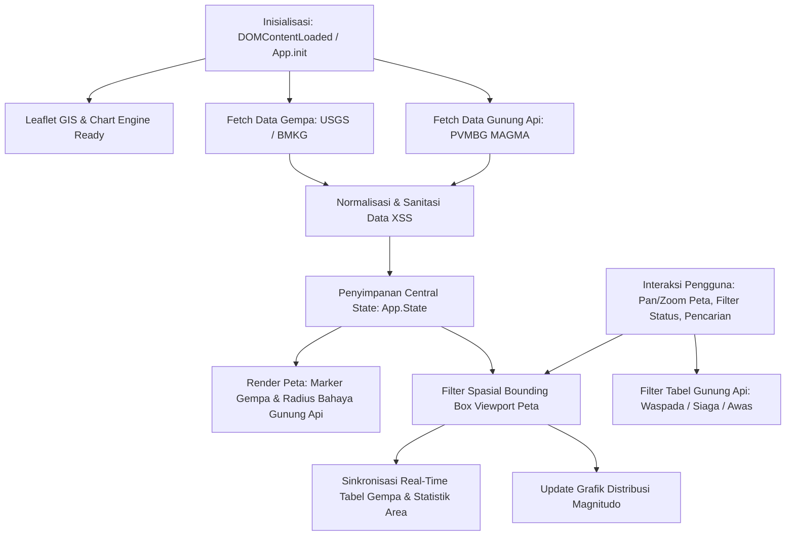
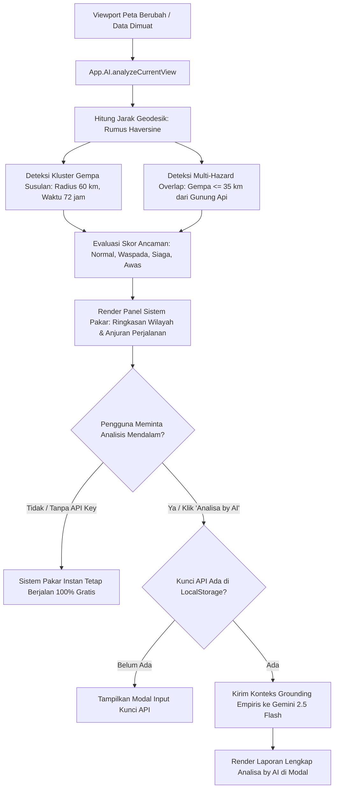

# PANTAU GEMPA & GUNUNG BERAPI 🌋🌍

Aplikasi web interaktif modern untuk memantau aktivitas **Gunung Berapi di Indonesia** serta kejadian **Gempa Bumi** secara *real-time* maupun historis. Mengintegrasikan data terbuka (*Open Data*) resmi dari **PVMBG MAGMA Indonesia**, **BMKG**, dan **USGS**.

Aplikasi ini dapat diakses langsung secara online melalui: **[https://pantaugempa.isparmo.com](https://pantaugempa.isparmo.com)**

---

## 📋 Fitur Utama

### 🌋 1. Pemantauan Gunung Berapi Aktif (PVMBG MAGMA Indonesia)
- **Monitoring 69 Gunung Api Aktif di Seluruh Indonesia**: Memuat data resmi status terkini, ketinggian elevasi (mdpl), rekomendasi keselamatan sektoral, dan tautan laporan detail berkala.
- **Visualisasi Level Status & Radius Bahaya di Peta**:
  - 🔴 **Level IV (AWAS)**: Lingkaran radius bahaya kritis dengan animasi denyut (*pulsing animation*).
  - 🟠 **Level III (SIAGA)**: Lingkaran radius bahaya oranye tebal dan peringatan sektoral.
  - 🟡 **Level II (WASPADA)**: Lingkaran radius bahaya kuning waspada.
  - 🟢 **Level I (NORMAL)**: Ikon gunung hijau menandakan aktivitas dasar fluktuasi normal.
- **Popup Informasi Komprehensif**: Banner status & arti level resmi, estimasi radius bahaya sektoral, rekomendasi keselamatan, tanggal laporan, tombol fokus peta, tombol pembuka glosarium level, dan tombol langsung ke laporan PVMBG.
- **Tabel Khusus Gunung Berapi Berstatus Waspada / Siaga / Awas**:
  - **Filter Status Mandiri (*Individual Status Filter*)**: Tombol pill filter terpisah untuk **Semua**, **Awas**, **Siaga**, dan **Waspada** lengkap dengan *badge* hitungan dinamis.
  - **Pencarian Cepat**: Filter instan berdasarkan nama gunung atau provinsi.
  - **Kartu Statistik Terhubung (*Clickable Stats Cards*)**: Klik langsung pada kartu statistik Level IV, III, atau II untuk menyaring tabel secara cepat.
  - **Fokus Peta (*Center & Open Popup*)**: Tombol pada tabel yang langsung menggulirkan layar, memusatkan peta, dan membuka popup gunung api terkait.
  - **Ekspor Data Gunung Api ke CSV**: Unduh seluruh daftar gunung berapi aktif terfilter dalam satu klik.
- **Sinkronisasi Otomatis Berkala (GitHub Actions)**: Alur kerja otomatis tiap 24 jam untuk mengambil status terbaru dari PVMBG MAGMA Indonesia tanpa intervensi manual.

---

### 🗺️ 2. Peta Interaktif GIS (Leaflet.js)
- **Mode Layar Penuh (*Fullscreen Map*)**: Nikmati pengalaman visualisasi GIS luas dengan satu klik tombol atau tekan tombol `ESC`.
- **Basemap Terbuka & Gratis (Tanpa API Key)**:
  - **Mode Terang (*Light Mode*)**: Menggunakan **OpenStreetMap (OSM) Standard**.
  - **Mode Gelap (*Dark Mode*)**: Menggunakan **Esri World Dark Gray Base** yang elegan dan kontras tinggi.
- **Lapisan Lempeng Tektonik & Sesar Aktif**:
  - Garis batas lempeng tektonik global (**PB2002**).
  - Peta patahan sesar aktif geologi Indonesia bersumber dari Pusat Studi Gempa Nasional (**PuSGeN**).
- **Marker Gempa Dinamis**:
  - 🔵 **Biru** - Magnitudo < 4.5
  - 🟠 **Oranye** - Magnitudo 4.5 - 5.9
  - 🔴 **Merah** - Magnitudo ≥ 6.0
- **Sinkronisasi Otomatis Antara Peta & Tabel**: Menggeser (*pan*) atau memperbesar (*zoom*) peta secara otomatis memfilter data gempa pada tabel dan statistik di bawahnya.

---

### 📊 3. Dashboard, Statistik & Analisis Gempa
- **Banner Gempa Terkini**: Menampilkan kejadian gempa terbaru lengkap dengan magnitudo, kedalaman, waktu relatif (*time ago*), intensitas MMI (*Modified Mercalli Intensity*) atau CDI (*Did You Feel It?*).
- **Statistik Area Layar Peta**:
  - Total gempa di area pandang.
  - Magnitudo tertinggi di layar.
  - Kedalaman maksimal di layar.
  - Waktu gempa terbaru di area.
- **Grafik Distribusi Magnitudo (Chart.js)**: Diagram *doughnut* interaktif yang membagi kategori magnitudo (< 4.0, 4.0–4.9, 5.0–5.9, ≥ 6.0).

---

### 🔍 4. Filter & Pencarian Canggih Gempa
- **Multi-Sumber Data**:
  - **USGS Global API**: Kejadian gempa di seluruh penjuru dunia.
  - **BMKG Open Data**: Data gempa terbaru dan gempa dirasakan di Indonesia.
- **Filter Wilayah Geografis**:
  - Indonesia & Sekitarnya
  - Seluruh Dunia (Global)
  - Jepang, Filipina, Turki, Amerika Serikat
  - Bounding Box Peta Interaktif
- **Rentang Waktu**: 1 Jam Terakhir, 24 Jam, 7 Hari, 30 Hari, 1 Tahun, atau Rentang Tanggal Kustom.
- **Slider Magnitudo Minimum**: Atur magnitudo ambang batas dari M 0.0 s/d M 7.0+.
- **Pencarian Cerdas Alias Wilayah**: Otomatis mengenali kata kunci provinsi dan pulau di Indonesia (*NTT, NTB, Bali, Jawa Timur, Jawa Tengah, Jawa Barat, Sumatra, Sulawesi, Maluku, Papua*).
- **Ekspor Gempa ke CSV**: Unduh seluruh daftar gempa yang sedang terlihat di area layar.

---

### 🤖 5. Sistem Pakar & Analisa by AI (Travel & Situational Advisory)
- **Panel Peringatan & Rekomendasi Keselamatan Perjalanan**: Ditempatkan tepat di bawah peta interaktif untuk memberikan arahan langsung kepada masyarakat, pelancong (*travelers*), dan pegiat alam terbuka (*hikers*).
- **Sistem Pakar Spasial Instan (Tanpa Kunci API - 100% Gratis)**:
  - Berjalan langsung di peramban pengguna (*client-side*) secara instan tanpa biaya dan tanpa perlu API key.
  - Memanfaatkan kalkulasi jarak geodesik Haversine, deteksi kluster gempa susulan (*aftershock swarms*), tumpang-tindih multi-bahaya (*multi-hazard overlap*), dan scoring level ancaman (*Normal, Waspada, Siaga, Awas*).
  - **Penyebutan Wilayah & Daerah Secara Eksplisit**: Menyebutkan nama gunung beserta provinsi/daerahnya (misal: *Sinabung (Sumatera Utara), Semeru (Jawa Timur), Merapi (D.I. Yogyakarta/Jateng)*) serta lokasi gempa susulan agar arahan keselamatan tepat sasaran.
- **Analisa by AI (Analisis Narasi Mendalam)**:
  - Pengguna dapat memasukkan Kunci API Google Gemini milik sendiri untuk menghasilkan narasi mendalam seputar dinamika tektono-vulkanik, zona steril wisata, kesiapsiagaan warga, dan jalur transportasi.
  - Menggunakan model mutakhir **`gemini-2.5-flash`** dengan konfigurasi output penuh tanpa terpotong.
  - **Privasi & Keamanan Terjamin**: Kunci API disimpan secara eksklusif di `localStorage` perangkat pengguna dan dikirim langsung ke endpoint resmi Google AI tanpa perantara server pihak ketiga.

---

### ℹ️ 6. Glosarium Edukasi & Bantuan (About Modal)
- Penjelasan lengkap arti 4 tingkatan aktivitas gunung api PVMBG:
  - **Level I (Normal)**: Aktivitas dasar, aman beraktivitas.
  - **Level II (Waspada)**: Peningkatan aktivitas seismik di atas normal.
  - **Level III (Siaga)**: Peningkatan nyata, erupsi awal dapat terjadi.
  - **Level IV (Awas)**: Letusan utama berlangsung atau segera terjadi, zona evakuasi wajib dipatuhi.
- Glosarium istilah gempa: Magnitudo, Kedalaman, Skala MMI, dan Sesar/Patahan (*Fault*).

---

## 🏗️ Struktur Arsitektur Proyek (Modular)

Proyek ini dibangun menggunakan arsitektur **Modular Vanilla JavaScript & CSS** tanpa ketergantungan pada *build tools* (Webpack, Vite, atau Node.js), sehingga sangat ringan, cepat dimuat, dan langsung kompatibel dengan hosting statis seperti GitHub Pages:

```text
Pantau Gempa/
├── index.html                    # Layout semantik HTML & kerangka antarmuka
├── css/
│   └── style.css                 # Styling kustom (Leaflet popup, scrollbar, fullscreen, panel AI)
├── js/
│   ├── config.js                 # Konfigurasi tile map, alias wilayah Indonesia, batas geo & endpoint API
│   ├── utils.js                  # Sanitasi XSS (escapeHTML), konversi MMI Romawi, format waktu relatif
│   ├── state.js                  # Centralized state management (gempa, gunung api, filter, tema gelap)
│   ├── data.js                   # Komunikasi API (USGS, BMKG, PVMBG MAGMA) & ekspor CSV
│   ├── logic.js                  # Logika filter wilayah, magnitudo, sorting, dan filter viewport peta
│   ├── map.js                    # Leaflet GIS engine, layer lempeng/sesar, marker gempa & gunung api
│   ├── ai.js                     # Sistem Pakar Spasial instan, deteksi swarms & integrasi Gemini 2.5 Flash
│   ├── ui.js                     # Renderer tabel, grafik Chart.js, filter status gunung api & modal
│   └── app.js                    # Bootstrap inisialisasi aplikasi dan background auto-refresh timer
├── data/
│   ├── gunung-api.json           # Data lokal 69 gunung api aktif PVMBG MAGMA Indonesia
│   └── volcanoes-master.json     # Master koordinat dan metadata geografi gunung api
├── scripts/
│   ├── sync_volcanoes.py         # Skrip Python sinkronisasi data langsung dari PVMBG MAGMA Indonesia
│   └── build_master.py           # Utilitas penyusunan data master koordinat gunung api
└── .github/
    └── workflows/
        └── sync-volcano.yml      # Otomasi sinkronisasi data PVMBG harian via GitHub Actions
```

---

## 🧠 Logika & Cara Kerja Aplikasi (System Logic & Workflow)

Aplikasi dibangun dengan arsitektur **reaktif berbasis event (*event-driven reactive pattern*)** murni di sisi peramban (*client-side*) tanpa memerlukan server rendering ataupun *bundler*. Diagram alur berikut menggambarkan siklus kerja pemrosesan data dan interaksi antarmuka:



### 1. Siklus Hidup & Inisialisasi (*Lifecycle & Bootstrap*)
Saat halaman selesai dimuat (`DOMContentLoaded`), fungsi `App.init()` di [`js/app.js`](js/app.js) mengeksekusi urutan pemuatan paralel:
1. **Peta GIS (`App.Map.init()`)**: Menginisialisasi Leaflet di elemen `#map` dengan koordinat pusat Indonesia `[-2.5, 118.0]` pada zoom level 5, menambahkan tile layer sesuai tema aktif (OSM / Esri), serta menyiapkan grup layer lempeng/sesar dan gunung api.
2. **Grafik Statistik (`App.UI.initChart()`)**: Menginisialisasi Chart.js tipe *doughnut* untuk visualisasi kategori magnitudo gempa.
3. **Pemuatan Data Gempa (`App.Logic.fetchEarthquakeData()`)**: Mengambil data gempa bumi awal sesuai provider aktif (default: USGS Global).
4. **Pemuatan Data Gunung Api (`App.Data.fetchVolcanoData()`)**: Mengambil dataset 69 gunung api aktif Indonesia dari `data/gunung-api.json`.
5. **Background Timers**:
   - Menjalankan *live ticker* waktu relatif gempa terbaru setiap 60 detik.
   - Menjalankan *auto-refresh background timer* data gempa setiap 3 menit.

### 2. Penyerapan & Normalisasi Data Multi-Sumber (*Data Ingestion & Normalization*)
- **Data Gempa BMKG**: Mengambil data `gempaterkini.json` (gempa M ≥ 5.0) dan `gempadirasakan.json` (gempa dirasakan) secara paralel dengan *cache-busting* (`?_t=timestamp`). Sistem melakukan normalisasi tanggal/jam lokal Indonesia (WIB/WITA/WIT) ke objek waktu standar Unix timestamp, mengonversi string koordinat lintang/bujur menjadi angka desimal float, dan melakukan deduplikasi data gempa yang muncul di kedua feed.
- **Data Gempa USGS**: Mengirim HTTP GET request ke GeoJSON API USGS dengan parameter dinamis: `minmagnitude`, rentang waktu (`starttime`/`endtime`), dan batas koordinat wilayah (*bounding box* geo). Fitur GeoJSON dipetakan menjadi model data seragam: `{ id, mag, place, time, lat, lon, depth, mmi, cdi, source }`.
- **Data Gunung Api PVMBG MAGMA**: Membaca dataset terstruktur yang memuat status 69 gunung api aktif, koordinat presisi, elevasi, radius bahaya sektoral, dan tautan laporan resmi PVMBG.

### 3. Logika Sinkronisasi Spasial Peta & Tabel (*Spatial Bounds Sync*)
- Setiap kali pengguna menggeser (*pan*) atau memperbesar/memperkecil (*zoom*) peta, event Leaflet `moveend` mendeteksi batas koordinat pandang layar (`map.getBounds()`).
- Data gempa yang tersimpan di memori (`App.State.rawFetchedEarthquakes`) disaring secara cepat (*in-memory bounding box filtering*):
  - Memilih data di mana lintang berada di antara batas selatan & utara layar, dan bujur berada di antara batas barat & timur layar.
- Hasil penyaringan spasial ini langsung disinkronkan secara instan ke:
  - **Statistik Cepat**: Jumlah gempa terlihat, magnitudo tertinggi di layar, kedalaman maksimal, dan waktu gempa paling mutakhir.
  - **Tabel Gempa**: Di-render ulang secara instan tanpa membebani browser.
  - **Grafik Distribusi**: Doughnut Chart.js diperbarui secara dinamis.

### 4. Logika Pencarian Cerdas & Auto-Focus Geografis (*Smart Alias Zooming*)
- Sistem dilengkapi kamus alias geografis kepulauan Indonesia (`App.Config.REGION_ALIASES`).
- Saat pengguna mengetik nama pulau atau wilayah (seperti *"NTT"*, *"Lombok"*, *"Jogja"*, *"Bandung"*, *"Aceh"*, *"Ambon"*, *"Jayapura"*), sistem secara otomatis:
  1. Mengenali wilayah target dan mengambil titik koordinat pusat serta level zoom optimal.
  2. Mengarahkan peta secara halus (*smooth pan/zoom*) ke wilayah tersebut.
  3. Memfilter data gempa pada tabel sesuai wilayah yang dicari.

### 5. Logika Pemantauan Gunung Api & Filter Multi-Level (*Volcano Interactive Logic*)
- **Marker Dinamis & Radius Bahaya**: Marker gunung api dibuat dengan ikon kustom dengan kode warna status:
  - Merah (*Awas / Level IV*), Oranye (*Siaga / Level III*), Kuning (*Waspada / Level II*), Hijau (*Normal / Level I*).
  - Untuk gunung berstatus Level 2–4, sistem menggambar lingkaran radius bahaya sektoral (`L.circle`) dengan jarak kilometer resmi dari PVMBG.
- **Filter Status Mandiri pada Tabel**:
  - Filter status tabel (`Semua`, `Awas`, `Siaga`, `Waspada`) memfilter data secara instan:
    - **Awas**: Menampilkan khusus `level == 4`.
    - **Siaga**: Menampilkan khusus `level == 3`.
    - **Waspada**: Menampilkan khusus `level == 2`.
    - **Semua**: Menampilkan gabungan level elevated `level >= 2`.
  - Pencarian teks (nama gunung/provinsi) diterapkan secara reaktif di atas filter status yang aktif.
  - Tombol **"Peta"** pada tabel memicu `App.Map.focusVolcano(id)` yang menggulirkan layar ke peta, memusatkan koordinat (`setView`), dan otomatis membuka popup status detail.
  - Kartu statistik Level IV, III, dan II di panel kanan dapat diklik langsung (*interactive click*) untuk menyaring tabel secara cepat.

### 6. Logika Sistem Pakar & Analisa by AI (Travel & Situational Advisory)

Fitur analisis keselamatan memadukan dua pendekatan terintegrasi:



#### A. Sistem Pakar Spasial Klien (*Client-Side Geospatial Expert System - Zero API Key*)
- **100% Berjalan Lokal & Instan**: Tidak membebani kuota API dan dapat bekerja tanpa ketergantungan koneksi ke layanan AI eksternal.
- **Penyebutan Daerah & Provinsi**: Secara eksplisit mencantumkan nama daerah dan provinsi untuk setiap gunung berapi (misal: *Sinabung (Sumatera Utara), Semeru (Jawa Timur), Merapi (D.I. Yogyakarta/Jateng), Lewotobi Laki-laki (NTT)*) serta lokasi gempa susulan.
- **Kalkulasi Geodesik Haversine**: Menghitung jarak melengkung di permukaan bumi antarkoordinat lintang/bujur secara matematis presisi:
  $$d = 2R \arcsin\left(\sqrt{\sin^2\left(\frac{\Delta \phi}{2}\right) + \cos(\phi_1)\cos(\phi_2)\sin^2\left(\frac{\Delta \lambda}{2}\right)}\right)$$
  dengan radius rata-rata bumi $R = 6371\text{ km}$.
- **Deteksi Kluster Gempa Susulan (*Aftershock Swarms*)**: Menelusuri setiap gempa utama (*mainshock* dengan $M \ge 4.8$) dan menghitung gempa susulan yang terjadi dalam radius spasial $\le 60\text{ km}$ dan rentang temporal $\le 72\text{ jam}$. Jika terdeteksi $\ge 2$ gempa susulan, sistem menetapkan status kluster aktif yang berisiko merapuhkan lereng perbukitan dan memicu tanah longsor.
- **Deteksi Tumpang-Tindih Multi-Bahaya (*Multi-Hazard Overlap*)**: Mengidentifikasi kejadian gempa bumi yang episentrumnya berjarak $\le 35\text{ km}$ dari kubah/kawah gunung berapi aktif (Level II–IV). Fenomena ini dianalisis sebagai indikasi interaksi seismovulkanik yang memerlukan kehati-hatian ekstra.
- **Penetapan Level Ancaman (*Threat Level Scoring*)**:
  - 🔴 **AWAS**: Terdeteksi gunung api Level IV (Awas) atau gempa bumi kuat $M \ge 6.5$ pada area pandang.
  - 🟠 **SIAGA**: Terdeteksi gunung api Level III (Siaga), kluster gempa susulan aktif, gempa dangkal di dekat tubuh gunung api aktif, atau gempa bumi $M \ge 5.0$.
  - 🟡 **WASPADA**: Terdeteksi gunung api Level II (Waspada) atau gempa bumi $M \ge 4.0$.
  - 🟢 **NORMAL**: Kondisi seismovulkanik di area pandang dalam batas fluktuasi normal.
- **Formulasi Anjuran Perjalanan Praktis (*Actionable Travel Advisory*)**: Menghasilkan poin-poin anjuran keselamatan untuk pelancong dan pendaki gunung lengkap dengan nama daerahnya.

#### B. Analisa by AI (*Optional In-Depth Narrative Report*)
- **Model Mutakhir**: Menggunakan model Google **`gemini-2.5-flash`** dengan konfigurasi output penuh (token 8192) tanpa terpotong.
- **Strict Geological Grounding Prompt**: Mengirimkan data empiris yang sedang tampak di layar (status 69 gunung api aktif, provinsi/wilayah, radius steril rekomendasi PVMBG, gempa bumi aktif USGS/BMKG, hasil deteksi kluster susulan, dan kedekatan spasial). Sistem menginstruksikan AI secara ketat untuk **hanya menganalisis data faktual** yang diberikan dan menyusun laporan terstruktur:
  1. Kajian Ancaman Vulkanik & Kegempaan Wilayah
  2. Zona Bahaya & Anjuran Perjalanan Wisata
  3. Instruksi Kesiapsiagaan Bagi Masyarakat Sekitar
  4. Rekomendasi Jalur Transportasi & Logistik
- **Privasi & Keamanan Kunci API**:
  - Kunci API pengguna disimpan secara eksklusif di `localStorage` peramban pengguna.
  - Kunci **tidak pernah dikirim** ke server backend aplikasi ini atau server pihak ketiga mana pun.
  - Permintaan HTTP dikirim langsung dari peramban pengguna ke endpoint resmi Google: `https://generativelanguage.googleapis.com/v1beta/models/gemini-2.5-flash:generateContent?key=${apiKey}`.
  - Pengguna dapat memperbarui atau menghapus kunci API dari penyimpanan peramban sewaktu-waktu dengan satu klik pada modal pengaturan.

---

### 7. Logika Mode Layar Penuh & Reparenting Modal (*Fullscreen Top-Layer Logic*)
- Peta dapat beralih ke mode layar penuh memanfaatkan *Browser Fullscreen API* (`element.requestFullscreen()`).
- **Penanganan DOM Top-Layer**: Agar modal informasi "Tentang / Arti Level", modal Kunci API, dan modal Laporan Gemini tetap dapat dibuka saat peta dalam mode *fullscreen*, sistem secara dinamis memindahkan elemen modal ke dalam wadah layar penuh (`fsElement.appendChild(modal)`). Saat keluar dari fullscreen, modal otomatis dikembalikan ke `document.body`.
- Sistem mendengarkan event native `fullscreenchange` dan tombol keyboard `ESC` untuk mereset ukuran peta (`map.invalidateSize()`) dan memperbarui ikon tombol.

### 8. Keamanan & Sanitasi Data (*XSS Prevention*)
- Seluruh konten teks dinamis dari API pihak ketiga (nama lokasi gempa, rekomendasi keselamatan PVMBG, deskripsi intensitas MMI, dan output markdown dari Gemini AI) selalu melewati fungsi sanitasi `App.Utils.escapeHTML()` atau parser markdown aman sebelum disisipkan ke dalam elemen DOM atau Leaflet Popup. Ini memastikan aplikasi kebal terhadap potensi celah keamanan *Cross-Site Scripting* (XSS).

---

## 🛠️ Teknologi yang Digunakan

- **Markup & Layout**: HTML5 Semantik
- **Styling**: Vanilla CSS kustom + Tailwind CSS (via CDN)
- **Logika & Pemrograman**: Vanilla JavaScript (ES6+, tanpa bundler)
- **Peta Interaktif (GIS)**: Leaflet.js v1.9.4
- **Tile Map**: OpenStreetMap (Mode Terang) & Esri World Dark Gray (Mode Gelap)
- **Grafik & Visualisasi**: Chart.js v4.4.1
- **Ikonografi**: FontAwesome 6.4.0
- **Tipografi**: Google Fonts (Inter)
- **Otomasi Data Backend**: Python 3 (BeautifulSoup4) & GitHub Actions

---

## 📦 Sumber Data Resmi (*Open Data*)

1. **PVMBG (Pusat Vulkanologi dan Mitigasi Bencana Geologi)**: [https://magma.esdm.go.id](https://magma.esdm.go.id)
2. **BMKG (Badan Meteorologi, Klimatologi, dan Geofisika)**: [https://data.bmkg.go.id](https://data.bmkg.go.id)
3. **USGS (United States Geological Survey)**: [https://earthquake.usgs.gov](https://earthquake.usgs.gov)
4. **PuSGeN (Pusat Studi Gempa Nasional)**: Peta Sumber dan Bahaya Gempa Indonesia

---

## 🚀 Cara Menjalankan Secara Lokal

1. **Clone repositori**:
   ```bash
   git clone https://github.com/masisparmo/pantaugempa.git
   cd pantaugempa
   ```

2. **Jalankan server HTTP lokal**:
   - Menggunakan Python 3:
     ```bash
     python -m http.server 8080
     ```
   - Atau menggunakan Node.js / `http-server`:
     ```bash
     npx http-server . -p 8080
     ```

3. **Buka peramban**:
   Akses `http://localhost:8080` pada browser Anda.

---

## 🤝 Kontribusi

Kontribusi, kritik, dan saran untuk pengembangan aplikasi ini sangat disambut baik:
1. Fork repositori ini
2. Buat branch fitur baru (`git checkout -b fitur/nama-fitur`)
3. Commit perubahan Anda (`git commit -m "Menambahkan fitur X"`)
4. Push ke branch (`git push origin fitur/nama-fitur`)
5. Ajukan **Pull Request**

---

## 📝 Lisensi & Hak Cipta

&copy; 2026 Hak Cipta oleh **[ISPARMO](https://page.isparmo.com)**.  
Dilindungi di bawah lisensi terbuka untuk tujuan edukasi, kesiapsiagaan bencana, dan keselamatan publik.
